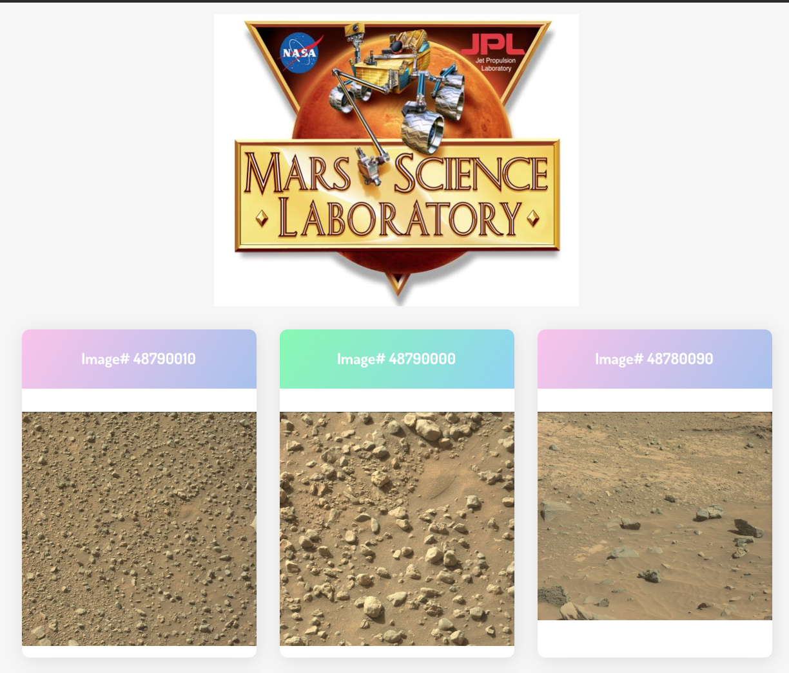
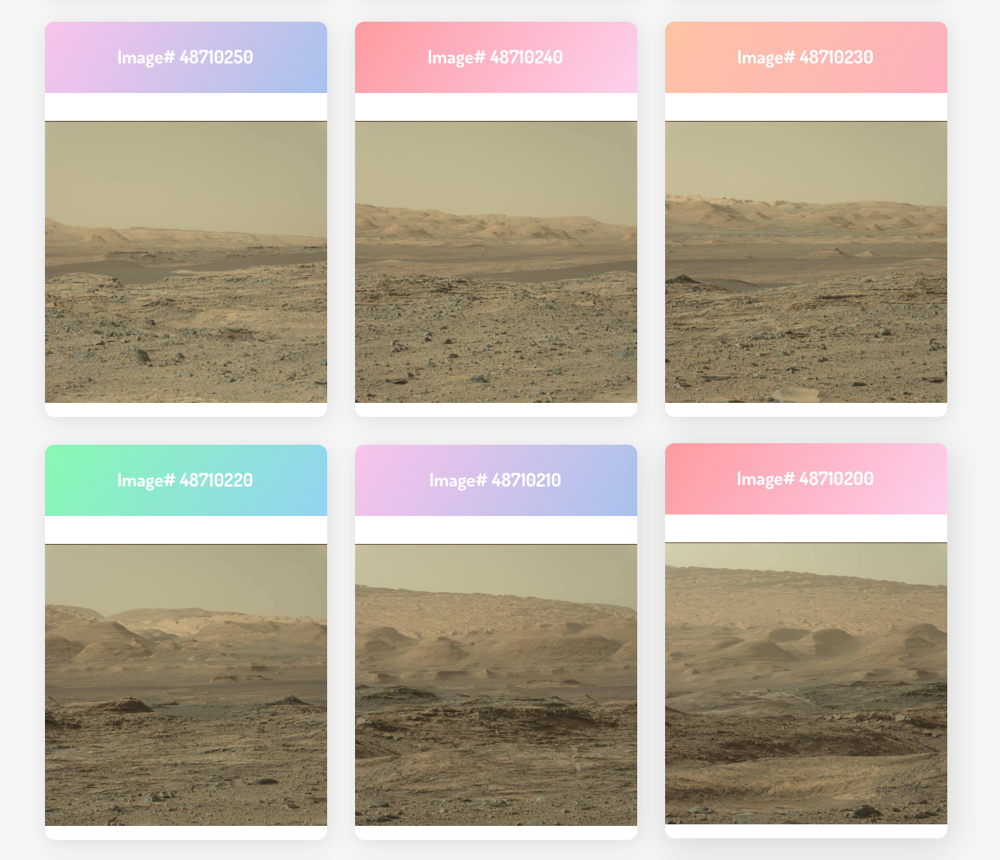

NASA API
========
Rebuilt repository originally created on 02-28-19
------------------

### Requests Mars rover images from NASA's API and creates cards for each image.

- Inspired by the tutorial - [How to Connect to an API with JavaScript](https://www.taniarascia.com/how-to-connect-to-an-api-with-javascript/) by Tania Rascia.
- Send request to NASA's API for Curiosity rover dataset of images.
- Filter out image urls from returned JSON.  
- Manipulate the DOM from within  `main.js` to create cards for each image url.
- Title the cards from a substring text of the url.

### Getting Started
If you would like to try it:
- You will need a NASA API key.
- Add `env.js` to `.gitignore`.
- Create `env.js` file using `env.example` for reference.
- Add your fresh new NASA API key to `api_key` inside `env.js`.
- Bask in glorious Mars photos.

#### 🌮taco-tues-on-a-fri
